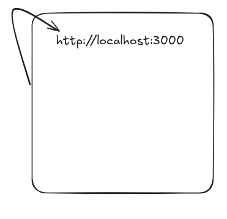

# Domains vs ip's

Localhost is also a domain name
"Localhost" refers to the computer you're currently working on. It's essentially a loopback address that points to the machine itself, allowing it to communicate with itself over a network. In technical terms, the IP address for localhost is usually 127.0.0.1 for IPv4, or ::1 for IPv6.

There are two types of ips

ipv4                              
132.11.22.133
11.11.22.33
0.1.2.3

It can only be of 8 bits 
It can only be from 0 to 255
There are a limited number of ip address
256 ^ 4

All big companies buy ip addresses

we find a server through an ip address
and it is finding us though an ip address 

Is this an ipv4 address 142.250.192.106:443 ? 
the address 142.250.192.106 is an IPv4 address. IPv4 addresses consist of four decimal numbers separated by periods, where each number can range from 0 to 255. In this case, 142, 250, 192, and 106 all fall within that range.

ipv6
An IPv6 address is the next-generation internet protocol address used to identify devices on a network, replacing the older IPv4 system. It was introduced because IPv4 (which has ~4.3 billion unique addresses) is running out of space.

Structure of an IPv6 Address
An IPv6 address looks like this:
2001:0db8:85a3:0000:0000:8a2e:0370:7334

It consists of 8 groups of 4 hexadecimal digits.

Leading zeroes can be omitted: 2001:db8:85a3::8a2e:370:7334

:: represents one or more groups of all-zeroes and can appear only once in an address.

Domain name has a recognizable name through which the website can be identified

The domain name points to a number which is an ip address

